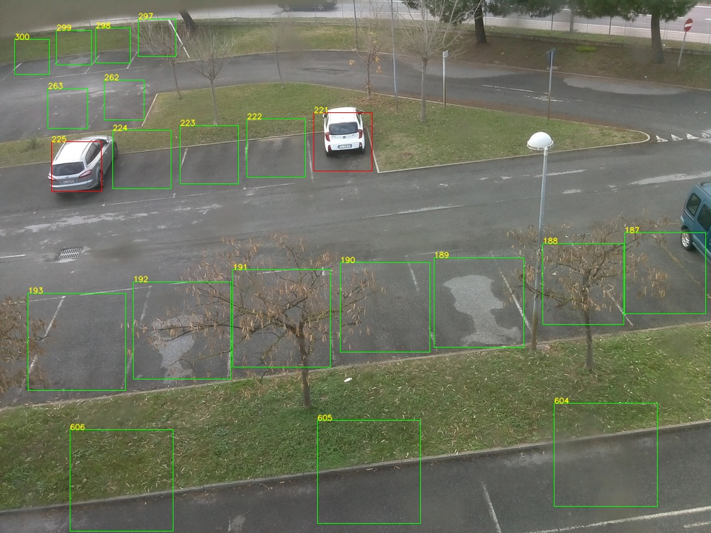

# Parking lot occupancy detection using YOLOv5

This is my final project for *Computer Vision*.

 

## Abstract

This report presents a computer vision algorithm for parking lot occupancy detection. It is based on the use of YOLOv5, a
one-stage deep learning object detector. The proposed solution is tested on CNRPark, a dataset containing images of the parking
lot of the CNR (National Research Council) in Pisa. The images are taken on different days and times, from different viewpoints
and with different light and weather conditions. Some of them include shadows and occlusions which make the occupancy detection
task even more challenging. The results of the evaluation show that the algorithm is effective as long as its parameters are properly
tuned. If so, the proposed approach proves to be robust not only to the variety of CNRPark but also to shadows and occlusions.

 

## Results

|   |   |   |
|---|---|---|
 |  | 
 |  | 
 |  | 

***

<h5 align="center">Computer Vision University of Padua, A.Y. 2021/22</h5>

  

